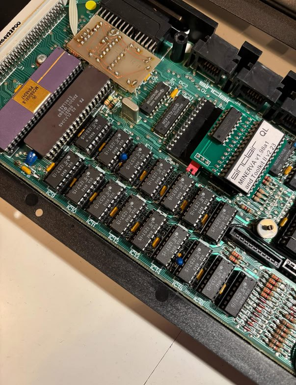

# Minerva RAM Test
Revision of the RAM Test Utility for Sinclair QL computer to detect faulty RAM ICs.

Link to the online version: https://www.nightfallcrew.com/minervaram/ram_fail_test.php

Minerva RAM test is the name for this repository, but actually it has not accurate with the original development.

A better name would be RAM Fail Test, but to follow the most known name, I keep it like it is.

## Update
22/12/2025 **Standalone Java version** for all platforms available.

## Introduction

Sinclair QL power design often drove into a common problem of get a RAM IC faulty or burned out, **Dominic Brown** wrote in 1990 a rutine in **SuperBasic** that was able to detect in a very smart way which RAM IC was compleately out. The routine <ins>gives 3 codes to detect the faulty IC</ins>. The main problem was that for running this routine <ins>you would need a working QL with Microdrive or similar working device to run it out, what was not easy at all if you only own one machine</ins>. The use of emulators was not common at that time.

Thanks to the main routine that detect the faulty IC was implemented into the **Minerva ROM**, every user could get the codes and pass them to the Basic program to detect the faulty IC, yet it required another machine full working for decoding the results.

In 2015, 15 years later **Xad/Nightfall** ported the code to a **PHP** file giving a great tool for the comunity. That was a very good step foward cause <ins>broke up with the neccesity of a working QL</ins>. With the Internet in every device and every home, it was not neccesary anymore to rely in a second machine or emulator to get decoded the information that report the faulty IC.

The user must introduce the 3 codes them into the PHP mentioned tool at http://www.nightfallcrew.com/minervaram. Sadly it was only useful for a part of users that have a QL with stock RAM of 128K.

## Later distribuitor modifications
When Sinclair started to sell the Sinclair QL (and till the end of its production) the amount of memory was 128KiB distribuited in the main PCB placed in 16 sockets of 64Kbits each.

But some distribuitors use to make some **modification on the main board replacing the original TMS-4164 for MT-1257 of 256Kbits each increasing the total amount of RAM till 512KBytes**. That was the case of the <ins>Danish company H.Christensen&Søn as</ins>. 

The modification relies in a extra glue logic added to the computer (*usually between the CPU and the ROM port*) as seen in the next picture:

Another **similar modification increased the amount of RAM up to 640KBytes using NECD41256C in piggy back on the original RAM** (*not pictures available yet*)

In those cases, the excellent work done by Dominc & Xad/Nightfall was helpless due to **the algorithm relies on a maximun of 128KBytes over the ROM zone, it means from 20000Hex to 30000Hex** (*Bellow 20000H is reserved to the ROM memory and some I/O areas*). So the maths were outside of the ranks beliving it was in a external RAM when actually it was placed in the main PCB sockets from IC1 to IC16.

The algorithm detect it is over 30000H and stops the process abruptaly without giving a suspected IC.

## Motivation
Due to what mentioned aboved, here is a remake of the code that allows to other users with modifications that expand the original memory placed on the ICs sockets/places till 512K (Danish mod) or 640K to get the right IC that is faulty.  

>So why not to give a solution to this situation? Let's do it.  Would be it so difficult to adapt? Obviously not, I did it (*seems that*).

## Resolution
Thanks to the code was pretty well smart&design it was easy to adapt. The main idea is that the memory still is distribuited by the sockets in a porportional way. Thus telling to the algorithm the limits of the RAM address, setting the floor and calculating the middle point (*16 ICs distribuited by 2 rows of 8 for upper and lower zone of the whole RAM amount*) now it should determinate and indicate the right IC, keeping the compatibility with the previous version but also with those Sinclair QLs with such modifications.

The next was to determinate the 3 ceils and middle points, thanks that base didn't change the address (20000H):

+ 128K => ceil at 40000H (*default*) 
+ 512K => ceil at A0000H
+ 640K => ceil at C0000H

So the equation for the middle point that separate the two rows of RAM ICs on the board is:
> $MiddleAdrr=((ceil - floor) / 2) + floor$

To make it easier now the PHP page shows new fields that allows the user to select among 3 different types of Sinclair QL amount of RAM. The default one is 128K (*the most common*).

Also was interesting to add some changes on the information of the page, that could helps to the users (*moreover non technical skilled users*) to understand what is happening, where and how to introduce the codes.

Dividing the page in 3 sections also gives the chance for some extra improvements.

### Section 1 Inputs
This area is dedicated to select the Sinclair QL model with the amount of RAM available on the main PCB, the three codes from the detection routine (*Write, Read and Address*) and finally to submit the datas in order to process them.

Also keep the reset buttom that clean the form.

> [!IMPORTANT]
> In case of no datas introduced, when submited it shows an example of the output that would obtain in a real example. The send datas to the program are shown in light grey colour inside each text field.

### Section 2 Process
Now the results is headed by a label that indicate if it's an example to show how it works or the result of the real calc of 3 introduced codes. You can tell it by the proper word but also by the colour of the text.

The interface shows which processed datas were introduced into a table, with coloured strips to give some extra confort to check out that codes corresponds with the expected.

It's interesting when you may want to check out the introduced the codes looking for mistakes, you'd save time to introduce them twice, three times... just in case.

### Section 3 Output
The format of the ouput remain the same than the previous version. If it is simple and works, don't touch it. 

> [!CAUTION]
> The result may not correspond with a real faulty IC, it helps but it is not determinated since in the real hardware also are implied more ICs like the multiplexers, or pasive components. So it gives a starting point that in 90% of cases is the guilty component.

## Results
**In few words Full Success.**

I has been tested with some original warning Minerva codes taken from faulties 128K QLs and also with a faulty QL with Danish mod of 512K.

Not tested yet with mods of 640K (usually this mod has an extra IC in piggybag over original RAM ICs), but should work the same

> [!CAUTION]
> Not fully tested yet with 640K mod, so use it under your own risk. Remember the information is orientative and may not be determinant.

 
 

## Standalone Java Version
There is one full functional version standalone for shell enviroments. It will be changing some cosmetic details but same functional tool.

[Download Java version](Java_Version/compiled_versions)

[Tool Video Presentation](https://www.youtube.com/watch?v=xmqasY3NnSw)

*In some days also a standalone with GUI interface.*

 
*Running on windows 11*

 
*Running on MacMini M4*

 
*Running on Linux x86*

---
## What's next?
Here are some ideas that maybe I would attend.

- [x] Adapt the code for modified Sinclair QLs with 512KB RAM
- [X] Adapt the code for modified Sinclair QLs with 640KB RAM
- [X] Improve the user interface for better understanding
- [X] Add to the user interface the controls to select the right QL
- [ ] Add other suspect IC (multiplexers) based on the results
- [X] Create a Java APP to run to decode the codes without Internet
- [X] Create a graphical representation of results (Memory map & IC Layout)
- [ ] Create a C program for Sinclair QL instead a Basic one
- [ ] Create an external ROM with the C code to test a QL without opening it.
- [ ] Add contextual help to the PHP code (without JavaScript) to helps to the user to determinate (*when required*) the kind of RAM it has.
- [ ] Modify the SBASIC program to add new features that would result in a deep scan of the memory, not only to detect a faulty burned IC.

By now it is more than enough.

## The code
You can find the code in the proper folder RAM_Test with the name of ram_fail_test.php along as other files.

## Credits
The Original Program (ram3_ramfail.bas) was written for the SINCLAIR QL in SUPER BASIC language by Dominic Brown (1990).
Converted in PHP language by Xad/Nightfall (8/5/2015).

*Special thanks to: Johan Engdhal for giving me the PHP functional and updated original code. And Thomas Kolbeck for grating me pictures and extra information about the Danish company.*
